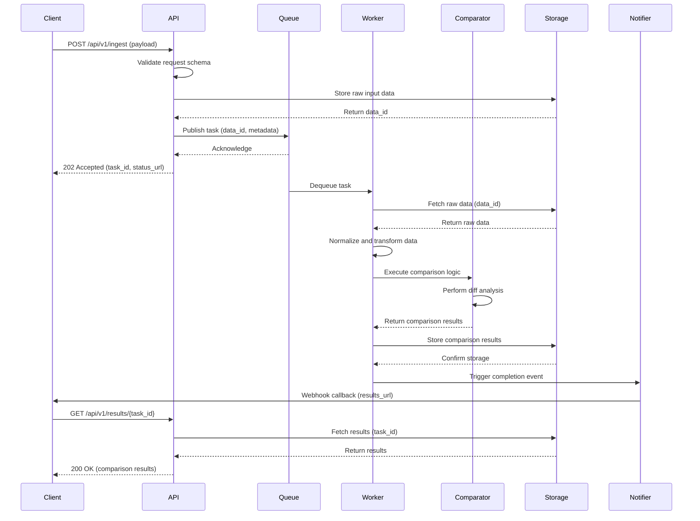
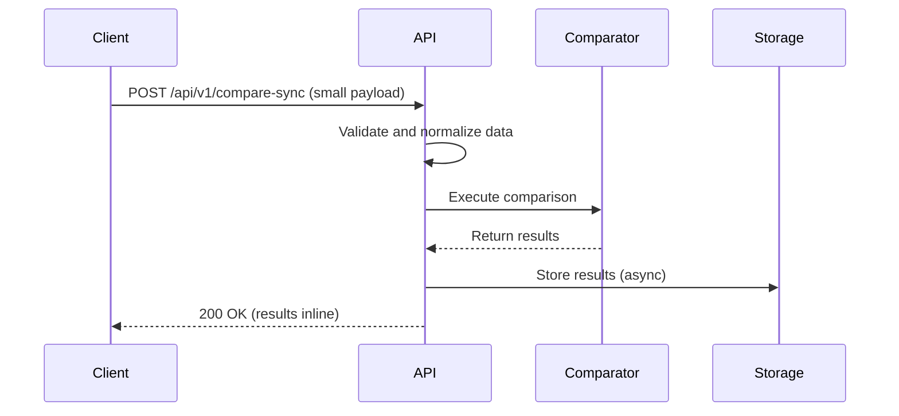
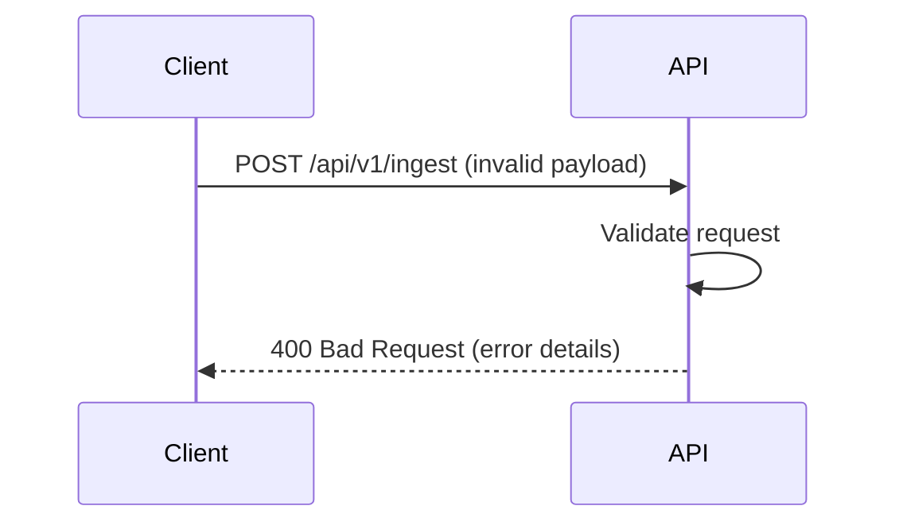
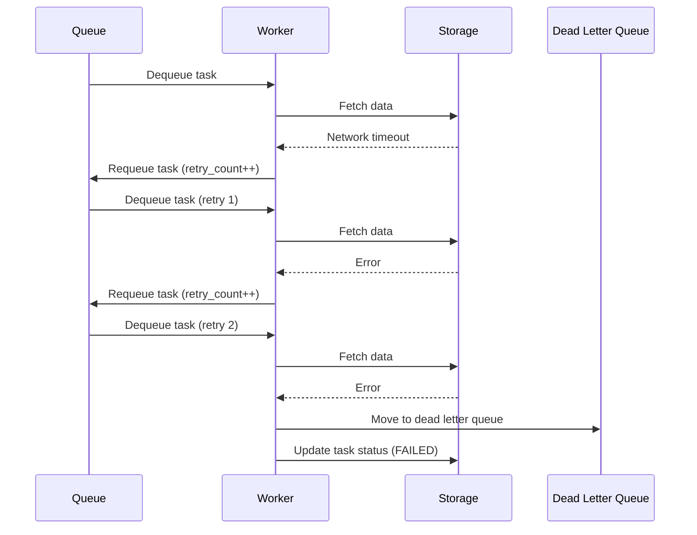
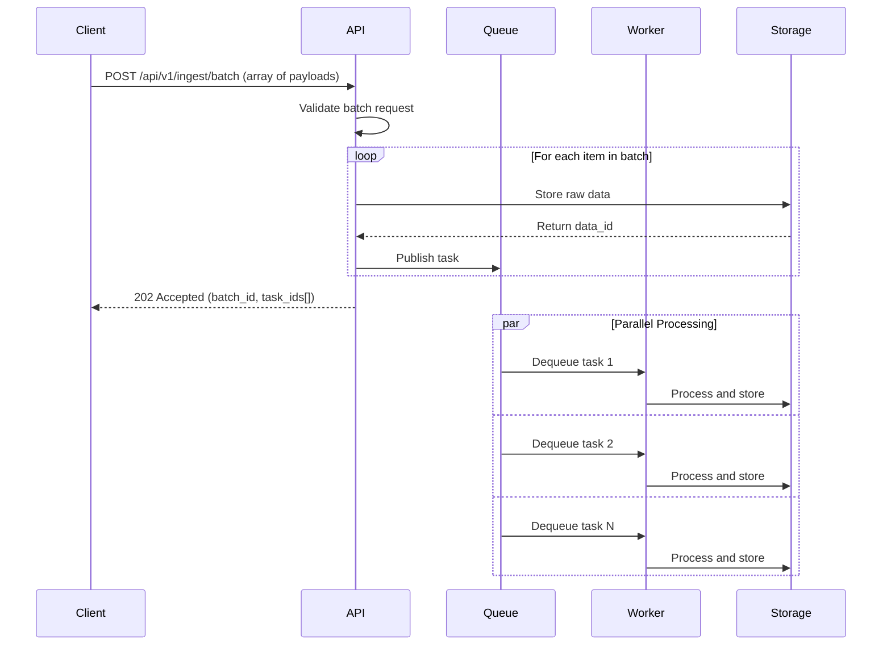
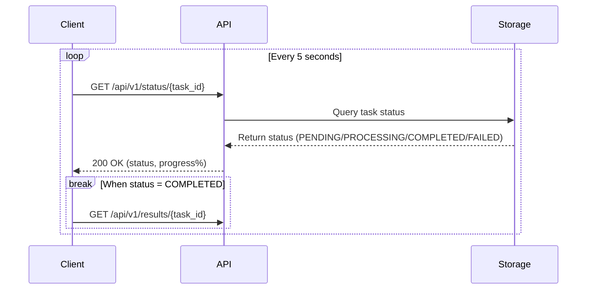
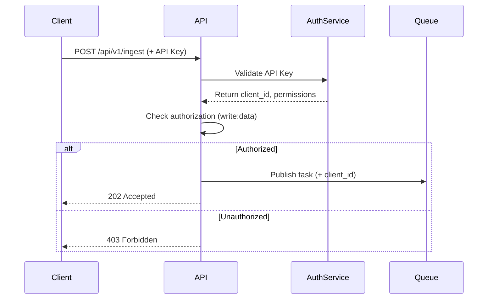

# Sequence Diagram

This document describes the key interaction flows within the system, detailing how components communicate to process data ingestion, comparison, and result delivery.

---

## 1. Overview

The system follows an asynchronous, event-driven architecture where client requests are processed through multiple stages:
- **API Layer**: Receives and validates incoming requests
- **Message Queue**: Decouples request handling from processing
- **Worker Pool**: Processes tasks asynchronously
- **Comparison Engine**: Performs data analysis and comparison
- **Storage Layer**: Persists results and intermediate data

---

## 2. Primary Flow: Data Ingestion and Comparison

### 2.1 High-Level Sequence

```
Client → API → Queue → Worker → Comparator → Storage → Client (via callback/polling)
```

### 2.2 Detailed Sequence Flow



---

## 3. Alternative Flow: Synchronous Processing (Small Payloads)

### 3.1 Sequence for Lightweight Requests



**Use Case**: When payload size < 1MB and processing time < 5 seconds

---

## 4. Error Handling Flow

### 4.1 Validation Failure



### 4.2 Processing Failure with Retry



**Retry Policy**: Max 3 retries with exponential backoff (2s, 4s, 8s)

---

## 5. Batch Processing Flow

### 5.1 Bulk Ingestion Sequence



---

## 6. Status Polling Flow

### 6.1 Client Polling for Task Status



---

## 7. Component Interaction Patterns

### 7.1 Communication Protocols

| Source | Target | Protocol | Pattern |
|--------|--------|----------|----------|
| Client | API | HTTP/REST | Request-Response |
| API | Queue | AMQP/SQS | Publish-Subscribe |
| Queue | Worker | AMQP/SQS | Consumer Pull |
| Worker | Comparator | In-Process | Function Call |
| Worker | Storage | HTTP/gRPC | Request-Response |
| Notifier | Client | HTTP/Webhook | Event-Driven |

### 7.2 Message Format (Queue)

```json
{
  "task_id": "uuid-v4",
  "data_id": "uuid-v4",
  "operation": "compare",
  "priority": "normal",
  "metadata": {
    "source": "api",
    "timestamp": "2026-05-05T10:30:00Z",
    "retry_count": 0
  },
  "callback_url": "https://client.example.com/webhook"
}
```

---

## 8. Timing and Performance Considerations

### 8.1 Expected Latencies

| Stage | Expected Duration | SLA |
|-------|-------------------|-----|
| API Validation | < 100ms | 99.9% |
| Queue Publish | < 50ms | 99.9% |
| Worker Pickup | < 2s | 95% |
| Comparison Processing | 1-30s | 90% < 10s |
| Storage Write | < 500ms | 99% |
| Total (Async) | 3-35s | 90% < 15s |

### 8.2 Scalability Notes

- **API**: Horizontally scalable (stateless)
- **Queue**: Managed service with auto-scaling
- **Worker**: Auto-scales based on queue depth (min: 2, max: 50)
- **Comparator**: CPU-bound, scales with worker instances
- **Storage**: Distributed database with read replicas

---

## 9. Security Flow

### 9.1 Authentication and Authorization



---

## 10. Monitoring and Observability

### 10.1 Trace Propagation

```
Client (trace_id) → API (trace_id, span_id:1) → Queue (trace_id, span_id:2) → 
Worker (trace_id, span_id:3) → Comparator (trace_id, span_id:4) → Storage (trace_id, span_id:5)
```

**Instrumentation**: OpenTelemetry spans at each component boundary

### 10.2 Key Metrics Collected

- **API**: Request rate, error rate, latency (p50, p95, p99)
- **Queue**: Queue depth, message age, throughput
- **Worker**: Processing time, success rate, retry rate
- **Comparator**: Comparison duration, result size
- **Storage**: Write latency, read latency, error rate

---

## 11. Diagram Conventions

### 11.1 Symbols Used

- **→**: Synchronous request
- **-->>**: Synchronous response
- **->>**: Asynchronous message
- **par**: Parallel execution
- **loop**: Iterative process
- **alt**: Conditional branching

### 11.2 Status Codes Referenced

- **202 Accepted**: Async task queued
- **200 OK**: Successful response
- **400 Bad Request**: Validation error
- **403 Forbidden**: Authorization failure
- **500 Internal Server Error**: Processing failure

---

## 12. Related Documentation

- [High-Level Design](./high-level-design.md) - System architecture overview
- [Data Model](./data-model.md) - Entity schemas and relationships
- [API Contracts](../docs/api-contracts.md) - REST API specifications
- [Async Processing](../docs/async-processing.md) - Queue and worker details
- [Comparison Engine](../docs/comparison-engine.md) - Algorithm documentation

---

**Last Updated**: 2026-05-05  
**Version**: 1.0  
**Maintained By**: Architecture Team
